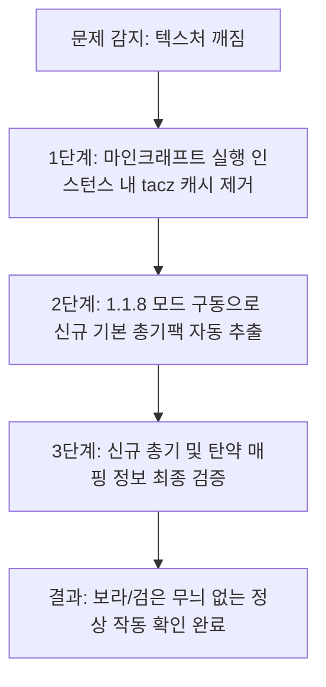

# [구현 계획서] TACZ 1.1.8 업데이트 및 아이템 깨짐 오류 교정 계획

기존 TACZ `1.1.7-hotfix2` 버전에서 `1.1.8-hotfix` 버전으로 업데이트되면서 발생한 **게임 내 아이템 깨짐(보라색/검은색 텍스처) 및 총기 기능 미작동 오류**를 해결하고, 개발 환경과 실전 환경 모두에서 안정적으로 1.1.8 버전을 구동하기 위한 기술 구현 계획서입니다.

---

## 1. 문제 분석 및 배경

TaCZ 모드는 1.1.8 버전으로 올라가면서 **리소스 온디맨드 로딩 최적화** 및 **서버 리소스팩 통합화**와 같은 대규모 구조 변경이 있었습니다. 
* **원인**: 게임이 시작될 때 사용자의 인스턴스 폴더(`.minecraft/` 또는 `mcbr_forge_mod/run/`) 내에 기존 1.1.7 버전 당시 압축 해제되어 캐싱되었던 구형 `tacz` 설정 및 기본 총기 팩 리소스가 잔존하여 신규 1.1.8 모드와 충돌함.
* **증상**: 
  * 마인크래프트가 구형 리소스 및 매핑 정보를 사용하여 아이템 렌더링에 실패함 ➡️ 보라색 바둑판 무늬로 표시됨.
  * 신규 총기 로직(ADS 제어, 1.1.8의 독립적인 차징 시스템 등)과 기존 구형 설정값이 매칭되지 않아 루팅한 총기가 장전 및 발사되지 않음.

---

## 2. 제안하는 해결 방안 및 계획

기존 캐시 파일들을 완벽히 정리하고 1.1.8 규격의 신규 캐시를 자동 재생성하도록 설계된 4단계 교정 파이프라인을 제안합니다.

---

## 3. 세부 작업 항목 (Action Items)

### 3.1 [Component] 마인크래프트 게임 인스턴스 클리닝

#### [DELETE] 구형 캐시 디렉토리 제거
- **대상 경로**: 
  * 클라이언트/실제 실행 환경: `%appdata%\.minecraft\tacz\` 또는 `%appdata%\.minecraft\config\tacz\`
  * 모드 개발/워크스페이스 실행 환경: [mcbr_forge_mod/run/tacz](file:///E:/Projects/Minecraft_Mods/mcbr_forge_mod/run/tacz) (존재 시)
- **수행 내용**: 구형 1.1.7 기본 총기 리소스를 포함한 `tacz` 폴더 전체를 물리적으로 안전하게 삭제합니다.

---

### 3.2 [Component] 모드 실행 및 신규 리소스 생성

#### [NEW] 1.1.8-hotfix 규격 리소스팩 자동 추출 및 매핑 검증
- **수행 내용**:
  1. 마인크래프트를 1.1.8-hotfix 버전 모드가 설치된 상태로 런칭합니다.
  2. 게임 내부에서 새 `tacz` 폴더가 재생성되었는지 확인합니다.
  3. 클라이언트 `리소스 팩(Resource Pack)` 설정에 진입하여 TaCZ 기본 리소스팩이 정상 적용되어 활성화되었는지 눈으로 검증합니다.

---

### 3.3 [Component] 배틀로얄 데이터팩 루팅 테이블 및 명세 검증

#### [MODIFY] [TACZ_GUN_IDS.txt](file:///E:/Projects/Minecraft_Mods/ThirdParty/TACZ_GUN_IDS.txt)
#### [MODIFY] [TACZ_AMMO_IDS.txt](file:///E:/Projects/Minecraft_Mods/ThirdParty/TACZ_AMMO_IDS.txt)
- **수행 내용**: 
  * 1.1.8-hotfix에서 새롭게 추가되거나 변경된 총기 리스트(예: `kar98`, `lonetrail`, `rhino357` 등)가 `ThirdParty/` 폴더 내 ID 명세 텍스트에 누락 없이 기록되도록 최종 갱신합니다.
  * 데이터팩이 이 명세를 기준으로 총기를 셔플하거나 상자에 올바르게 주입하는지 확인합니다.

---

## 4. 검증 계획 (Verification Plan)

### 수동 검증 단계 (실제 마인크래프트 테스트)
1. **크래시 없는 정상 로드 확인**: 
   * 게임 로딩 중 텍스처 에러나 Registry 누락에 따른 중도 Crash 없이 메인 메뉴에 잘 도달하는지 확인합니다.
2. **보라/검은 바둑판 에러 해소 확인**:
   * 크리에이티브 모드 인벤토리의 TaCZ 탭 혹은 배틀로얄 로비에서 `/give @s tacz:modern_kinetic_gun{GunId:"tacz:glock_17"}` 명령어로 아이템을 지급받아 3D 모델 및 발사 성능이 정상적으로 출력되는지 눈으로 확인합니다.
3. **루팅 테이블 테스트**:
   * 게임 내에서 테스트용 명령어 `/function mcbr:debug/refill_chests`를 실행하고 생성된 필드 상자들을 열어 깨진 아이템 없이 신규 총기 및 탄약들이 정상적으로 배정되어 드롭되는지 검사합니다.
