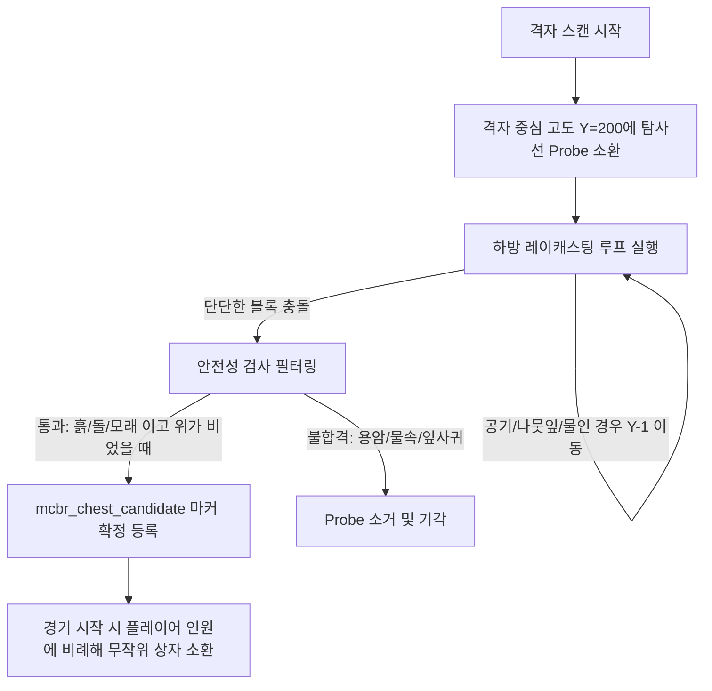

# [구현 계획서] 지형 적응형 자동 상자 후보지 시스템 (datapack2) 고도화 구현

본 계획서는 마인크래프트 배틀로얄 실험용 데이터팩(`battle_royale_datapack2`)의 핵심 장벽이었던 **"Y좌표 하드코딩(고정 Y=80)"** 및 **"비정상 지형(물, 용암, 나뭇잎) 상자 스폰"** 문제를 해결하기 위해, 하방 레이캐스팅(Raycasting) 및 안전성 체크 알고리즘을 설계하고 실제 매치 루프에 연동하기 위한 세부 구현 계획입니다.

---

## 1. 핵심 아키텍처 및 구현 개념

### 1) 하방 레이캐스팅 (Raycasting Downward)
하늘 고도(`Y = 200` 혹은 지표면 위 안전선)에서 `mcbr_candidate_probe` 마커를 격자별로 1개씩 소환한 뒤, 아래 블록이 통과 가능한 공기, 나뭇잎, 액체류인지 점검하여 단단한 땅바닥에 닿을 때까지 매 틱 혹은 반복 구조로 하강시킵니다.

### 2) 주변 환경 적합성 필터 (Safety Filter)
안착한 바닥이 스폰 적격지인지 검사합니다.
* **통과 조건**: 바닥이 `grass_block`, `dirt`, `stone`, `sand`, `clay` 등 단단한 재질이고 상자가 들어설 두 칸(`~ ~ ~`, `~ ~1 ~`)이 비어 있음.
* **거름망 조건**: 바닥이 `water`, `lava`, `#minecraft:leaves`이거나 낭떠러지 끝(사방이 절벽)인 경우 기각.

---

## 2. 세부 파일 변경 계획 (Proposed Changes)

### [Component: 스캐닝 및 탐사 엔진]

#### [MODIFY] [generate_chest_candidates.mcfunction](file:///e:/Projects/Minecraft_Mods/battle_royale_datapack2/data/mcbr/functions/map/generate_chest_candidates.mcfunction)
* **변경 사항**: 격자 후보지를 Y=80에 직접 소환하는 대신, 각 격자 좌표의 Y=200 높이에 `mcbr_candidate_probe` 마커를 임시 소환하고, 하방 탐색 루프(`raycast_downward`)를 점화합니다.

#### [NEW] [raycast_downward.mcfunction](file:///e:/Projects/Minecraft_Mods/battle_royale_datapack2/data/mcbr/functions/map/raycast_downward.mcfunction)
* **역할**: 프로브 마커를 착지할 때까지 아래로 하강시키는 재귀 함수입니다.
* **동작**:
  * 발밑이 공기, 물, 용암, 나뭇잎 등이면 한 칸 내려가서 자신을 재귀 호출합니다.
  * 일정 높이 이하(Y=30)로 내려가면 무한 루프 방지를 위해 자동 기각시킵니다.
  * 단단한 고체 블록에 도달하면 `mcbr:map/register_chest_candidate`를 호출합니다.

#### [MODIFY] [register_chest_candidate.mcfunction](file:///e:/Projects/Minecraft_Mods/battle_royale_datapack2/data/mcbr/functions/map/register_chest_candidate.mcfunction)
* **변경 사항**: 지형 검증 없이 다이렉트 등록하던 방식에서, **지형 안전성 필터링 검증** 과정을 붙여 합격한 경우만 `register_chest_candidate_commit`을 호출하고 최종 등록하도록 개편합니다.

#### [NEW] [verify_terrain_safety.mcfunction](file:///e:/Projects/Minecraft_Mods/battle_royale_datapack2/data/mcbr/functions/map/verify_terrain_safety.mcfunction)
* **역할**: 마커가 안착한 물리 블록 환경을 꼼꼼하게 검증합니다.
* **검사 조건**:
  * `execute unless block ~ ~-1 ~ minecraft:water unless block ~ ~-1 ~ minecraft:lava unless block ~ ~-1 ~ #minecraft:leaves ...`
  * 위 공간(`~ ~ ~`, `~ ~1 ~`)이 완전히 뚫려 있는 공기인지 확인.

---

### [Component: 매치 시작 및 셔플링 연동]

#### [MODIFY] [assign_field_loot.mcfunction](file:///e:/Projects/Minecraft_Mods/battle_royale_datapack2/data/mcbr/functions/loot/assign_field_loot.mcfunction)
* **변경 사항**: 이번에 새롭게 동기화해 둔 55라인 버전의 스포너 로직을 유지하면서, 격자로 소환된 유효 마커들 중에서 참여 플레이어 비례 공식(Common `n*4` 등)에 따라 실시간으로 상자 블록을 생성하고 통합 루트 테이블(`br_common`, `br_uncommon`, `br_rare`) NBT 데이터를 오버레이하도록 완전히 고도화 연계시킵니다.

---

## 3. 검증 계획 (Verification Plan)

### 🧪 수동 및 시각적 검증 단계
1. **격자 생성 검사**:
   * 게임 내에서 `/function mcbr:admin/generate_random_candidates` 명령어를 수행합니다.
2. **미리보기를 통한 실시간 고도·환경 체크**:
   * `/function mcbr:admin/preview_random_candidates` 명령어를 사용합니다.
   * **기대 결과**:
     * 상자 위치가 허공(Y=80)에 뜨지 않고 굴곡진 잔디바닥, 바위 위에 정확히 자석처럼 착지해 있어야 합니다.
     * 강(물속)이나 높은 나무 꼭대기 나뭇잎 위에는 어떠한 미리보기 표시도 뜨지 않아야(필터링 제거 완료) 합니다.
3. **매치 리필 검증**:
   * `/function mcbr:debug/refill_chests` 입력 후 무작위 상자들이 지형에 올바른 개수로 안착하고 열었을 때 54종 총기와 탄약이 제대로 드롭되는지 루팅 테스트를 수행합니다.
