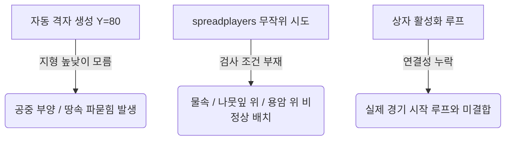

# [개발 계획서] 지형 적응형 자동 상자 후보지 시스템 개발 계획서

작성일: `2026-05-29` (최신 업데이트)
대상 네임스페이스: `mcbr (battle_royale_datapack2)`
상태: **1단계 프로토타입 진단 완료 및 2단계 고도화 설계**

---

## 1. 아키텍처 개요 및 배경 (Overview & Background)

기존 `battle_royale_datapack1`의 고정 후보지 방식은 사전에 좌표를 정교하게 선점(50개 한정)하므로 안정성이 높은 장점이 있으나, **맵이 교체될 때마다 좌표들을 수동으로 재취득해야 하는 한계**가 있습니다.

이 문제를 극복하기 위해 `battle_royale_datapack2`에서는 지형을 실시간으로 감지하고 안전한 지점에 상자를 동적 소환하는 **지형 적응형 자동 스캐닝 시스템**을 고안했습니다.

### 💡 핵심 지표 (Core Principles)
* **무중단 이식성**: 새로운 커스텀 맵을 올리더라도 마커 배치 노가다 없이 명령어 한 번으로 맵 특화 후보지를 스스로 추출합니다.
* **지형 지능화**: 산꼭대기, 평지, 사막에는 안전하게 생성하되 물속, 용암 위, 나뭇잎 위, 허공 등 비정상 지형은 스캐너가 자동 판별하여 배제합니다.

---

## 2. 현재 상태 정밀 분석 (Current Diagnostic State)

현재 구현된 시스템은 **"격자 스캔 통로와 디버깅 명령어는 완비되었으나, 지형을 읽는 지능이 누락된 프로토타입"** 단계입니다.

### 1) 격자 후보지 생성 (Mock 11x11 Grid Generation)
* [spawn_candidate_grid_candidates.mcfunction](file:///e:/Projects/Minecraft_Mods/battle_royale_datapack2/data/mcbr/functions/map/spawn_candidate_grid_candidates.mcfunction)을 실행하여 `(920, 920)` ~ `(1080, 1080)` 영역에 16블록 간격으로 총 121개의 마커(`mcbr_chest_candidate`)를 소환합니다.
* **진단 결과**: 현재는 모든 후보지가 지형 높이를 알지 못한 채 **`Y = 80` 고도에 강제로 공중/지하 스폰**되는 단순 디버그 모드입니다.

### 2) 중앙 구역 태깅 로직 완성
* 중심지인 `(1000, 1000)`에서 반경 32블록 이내에 배치된 후보지 마커들에 `mcbr_chest_center` 태그를 정확히 부여하고 Rare 등급 스폰 후보군으로 집계하는 Proximity 필터는 완벽히 컴파일됩니다.

### 3) 관리 및 시각화 도구 확보
* `/function mcbr:admin/candidate_status`: 현재 등록된 후보지의 총 개수와 중앙 구역 개수를 대화창에 실시간 통계로 표시합니다.
* `/function mcbr:admin/preview_random_candidates`: 후보지 위치에 파티클과 임시 블록을 띄워 눈으로 상자 위치 품질을 직관적으로 확인할 수 있게 돕습니다.
* `/function mcbr:admin/clear_random_candidates`: 월드에 깔린 스캔 마커들을 한 번에 청소합니다.

---

## 3. 핵심 병목 구간 & 과제 (Core Bottlenecks & Gaps)



1. **Y좌표(높이값) 스캐닝 부재**: 하방 고도 탐색 알고리즘이 구현되어 있지 않아, 경사지나 낭떠러지가 많은 맵에서 완전히 오작동합니다.
2. **지형 적합성 거름망(Filter) 없음**: 마커가 안착한 블록이 상자를 놓을 수 있는 단단한 블록인지 판별하지 못하고 물속이나 용암 한가운데에도 무조건 상자를 대기시킵니다.
3. **`spreadplayers` 랜덤 루프의 일시 우회**: 비정상 착지 지점을 소거하지 못해, 현재는 완전 무작위 생성 대신 121개 고정 격자 배치로 우회 가동 중입니다.

---

## 4. 고도화 개발 로드맵 및 기술적 해법 (3-Phase Technical Roadmap)

### 🚀 1단계: 하방 레이캐스팅(Raycasting) 착지 시스템 탑재
하늘(`Y = 255`) 혹은 지표 근방에서 아래로 감지용 프롭(Armor Stand 등)을 떨어뜨리거나, 마커 자체에서 아래 방향으로 블록 상태를 1블록씩 검사하며 안착 고도를 탐색하는 루프를 탑재합니다.

* **적용 함수**: [register_chest_candidate.mcfunction](file:///e:/Projects/Minecraft_Mods/battle_royale_datapack2/data/mcbr/functions/map/register_chest_candidate.mcfunction) 및 [register_chest_candidate_commit.mcfunction](file:///e:/Projects/Minecraft_Mods/battle_royale_datapack2/data/mcbr/functions/map/register_chest_candidate_commit.mcfunction) 개편.
* **구현 콘셉트**:
  ```mcfunction
  # 마커 위치에서 아래 블록이 공기(air), 나뭇잎(leaves), 물(water)이면 Y좌표를 1 내려서 자신을 다시 호출 (재귀 레이캐스트)
  execute as @e[tag=mcbr_candidate_probe] at @s if block ~ ~-1 ~ minecraft:air run tp @s ~ ~-1 ~
  execute as @e[tag=mcbr_candidate_probe] at @s if block ~ ~-1 ~ minecraft:air run function mcbr:map/raycast_downward
  ```

### 💧 2단계: 환경 안전성 적합도 필터 (Safety Filter) 도입
마커가 최종 착지한 위치의 발밑 블록과 머리 공간의 블록 태그를 검사하여 상자를 열 수 없는 불합격 후보지는 즉시 소거합니다.

* **필터링 체크리스트**:
  * **불합격**: 발밑 블록이 `water`, `lava`, `fire`이거나 나뭇잎 블록(`#minecraft:leaves`)인 경우.
  * **불합격**: 상자가 열릴 공간(몸통 및 뚜껑 위 `~ ~ ~` 및 `~ ~1 ~`)이 불투명한 블록으로 꽉 막혀 있는 경우.
  * **합격**: 발밑이 잔디, 흙, 돌, 모래 등 단단한 고체 블록이며 상자 뚜껑 위가 열려 있는 경우 ➡️ 마커로 승격 등록.

### 🎮 3단계: 매치 루프(Match Loop) 및 동적 셔플링 연동
안전성이 검증된 자동 마커들 중, 경기에 참여한 인원($active\_count$) 대비 상자 드롭 공식에 부합하는 수량만큼만 무작위 셔플링하여 상자로 활성화하고 라운드가 끝나면 복구하는 장치를 연동합니다.

* **수량 선택 공식**:
  * Common Chest = `n * 4`
  * Uncommon Chest = `(n - 1)^2 + 1`
  * Rare Chest = `floor(n / 2)` (오직 `mcbr_chest_center` 태그가 붙은 중심권 후보지 마커에서만 드롭)
* **적용 연계 파일**:
  * [assign_field_loot.mcfunction](file:///e:/Projects/Minecraft_Mods/battle_royale_datapack2/data/mcbr/functions/loot/assign_field_loot.mcfunction)
  * [refill_all.mcfunction](file:///e:/Projects/Minecraft_Mods/battle_royale_datapack2/data/mcbr/functions/loot/refill_all.mcfunction)
